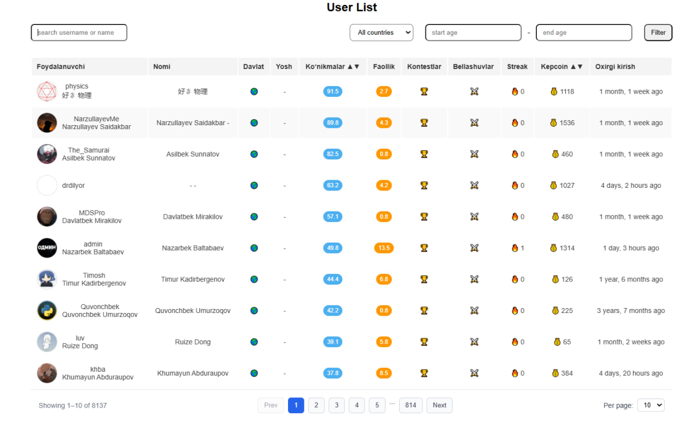
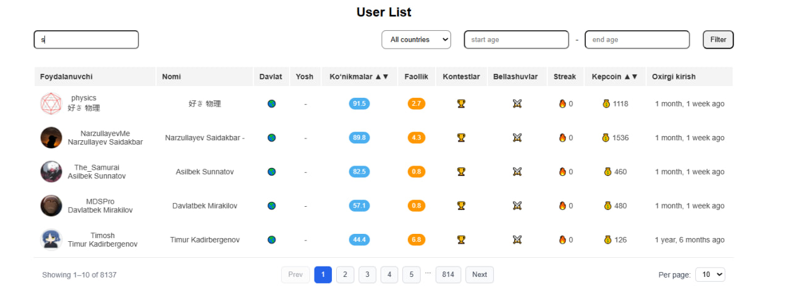

# Users List

# dasturni ishga tushurish uchun
```bash
ng serve
```

Userlarni ro'yhati chiqiarildi
unda search,pagination sort va filter ishlatish kerak edi

1.Userlarni ro'yhati api endpoinddan olib kelindi



2.search query ishlatmoqchi edim
```bash
private applyFilter(query: string) {
    const q = (query || '').trim();

    this.loading = true;
    this.userService.getUsers({ search: q }).subscribe({
      next: (res) => {
        this.allUsers = res?.data ? res.data : res;
        this.users = [...this.allUsers];
        this.loading = false;
      },
      error: (err) => {
        console.error('Xatolik:', err);
        this.loading = false;
      },
    });
  }
```

lk backend query ishlamadi shuning uchun frontda qilindi



```bash
  private applyFilter(query: string) {
    const q = (query || '').toLowerCase().trim();
    if (!q) {
      this.users = [...this.allUsers];
      return;
    }

    this.users = this.allUsers.filter((u) => {
      const username = u?.username?.toLowerCase() || '';
      const fullName = `${u?.firstName || ''} ${u?.lastName || ''}`.toLowerCase().trim();
      return username.includes(q) || fullName.includes(q);
    });
  }
```

3.Pagination o'rnatildi
changePage va changePageSize functionlarin yozildi 
lk pagelarni tartibga solish uchun generatePagination function yozildi


4.age bilan country data da yo'q bo'lgani uchun functionlarini yozmadim 
# to'g'riroqi angularga birinchi yozishim ko'p vaqt tushunishga ketyabdi

